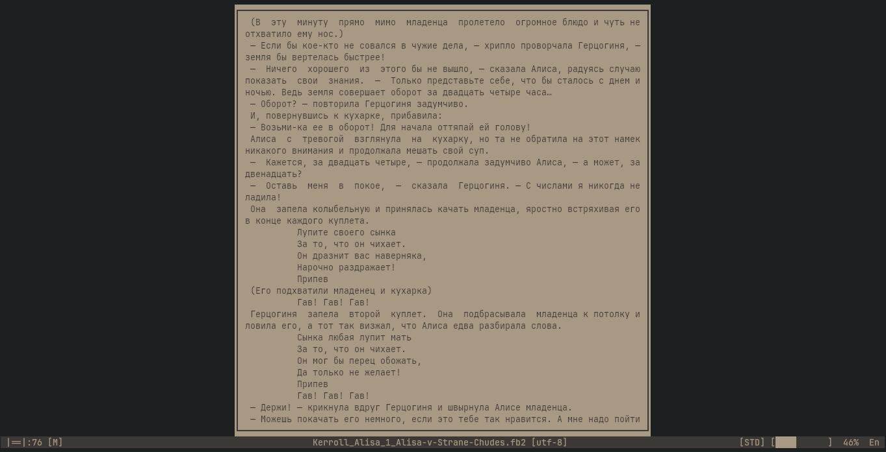
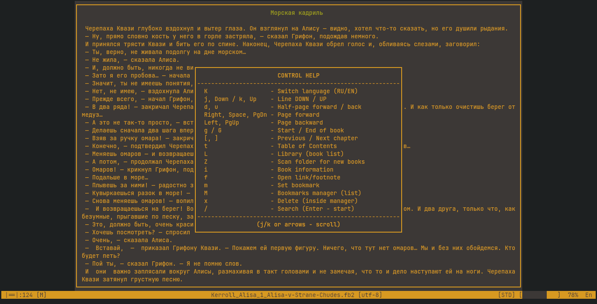
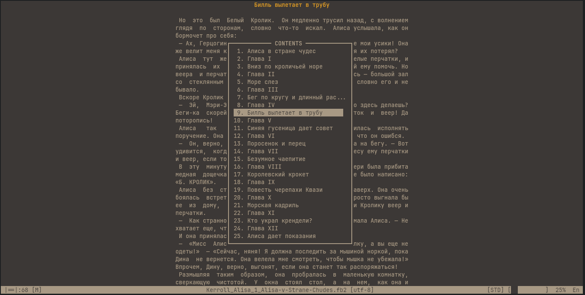
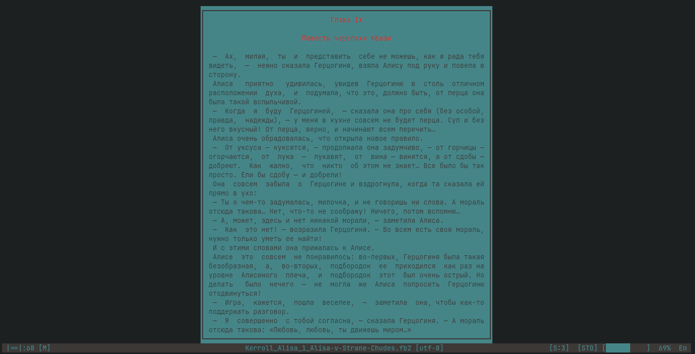

# fb2less (v0.8.4)
**1 May 2026**

Advanced terminal-based eBook reader for FB2, EPUB, and TXT formats.

## Features
- **Formats**: FB2, EPUB, TXT (including ZIP archives).
- **Localization**: Full English, German, and Russian support." (toggle with `K`).
- **Navigation**: Chapter jumps, progress bar `[███  ]`, and in-book search.
- **Library**: Built-in reading history with search support and per-book settings.
- **Customization**: 5 flip animation modes, colors, text width, and borders.
- **Bilingual Documentation**: Manual pages (man) available in both English and Russian.

## Screenshots
[](screenshots/01.png) [](screenshots/02.png)
[](screenshots/03.png) [](screenshots/04.png)

## Installation (Arch Linux)
1. git clone https://github.com/1mesles1/fb2less
2. cd fb2less
3. Run `makepkg -si`.

### Ubuntu / Debian (Build from source)
1. Install build tools:
   ```bash
   sudo apt update && sudo apt install python3-build python3-installer git
   ```
2. Clone the repository and build:
   ```bash
   git clone https://github.com/1mesles1/fb2less
   cd fb2less
   python3 -m build --wheel --no-isolation
   ```
3. Install the package and manual pages:
   ```bash
   sudo python3 -m installer dist/*.whl
   sudo cp fb2less.1 /usr/share/man/man1/
   sudo mkdir -p /usr/share/man/ru/man1
   sudo cp fb2less.ru.1 /usr/share/man/ru/man1/fb2less.1
   ```

## Usage
`fb2less [file]`
